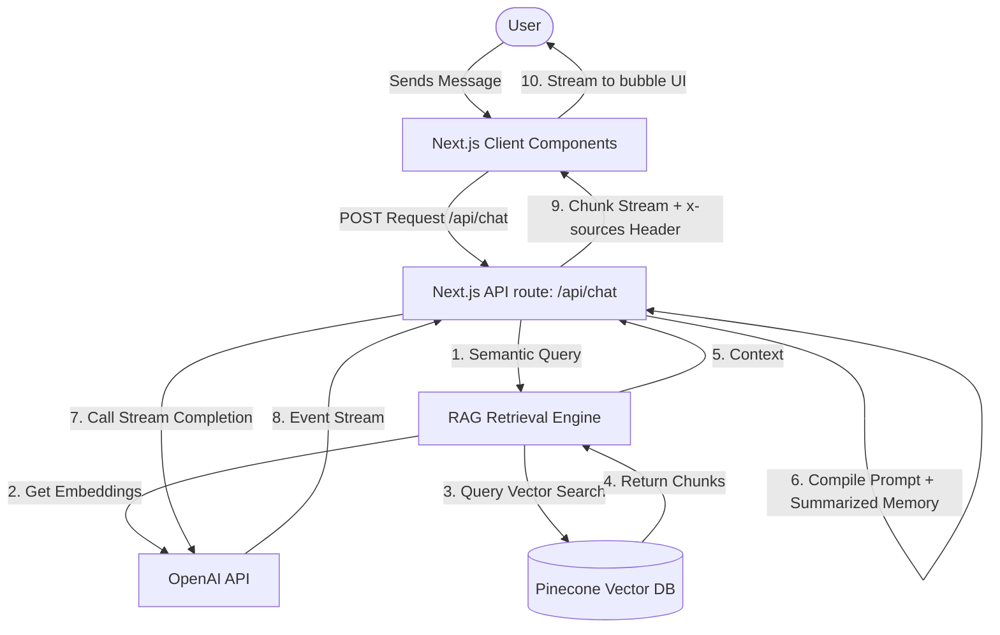

# System Architecture

This document describes the high-level architecture of the **Persona Chat** application, detailng how the user interface interacts with the streaming API, prompt engine, and retrieval systems.

## Data Flow Diagram

## Core Components

### 1. Frontend Layer
* **Client-Side Page (`app/page.tsx`)**: Manages individual chat histories for each persona in a dictionary state (`messagesByPersona`).
* **Streaming Reader**: Reads raw stream chunks from the response body and appends them dynamically to the active message content.
* **Citation Handler**: Extracts source citations from the custom HTTP response header `x-sources` and attaches them to the generated response bubble.

### 2. API Router (`app/api/chat/route.ts`)
* Acts as the coordinator. Coordinates RAG retrieval, invokes prompt construction, starts the OpenAI chat completion stream, and formats headers.

### 3. Retrieval Engine (`lib/rag.ts`)
* Uses `text-embedding-3-small` (1536 dimensions) to turn user queries into vectors.
* Performs a vector similarity search (cosine metric) in Pinecone, using a metadata filter to isolate the selected persona (`hitesh` or `piyush`).

### 4. Memory & Prompt Compiler (`lib/prompt-builder.ts` & `lib/ai.ts`)
* Slices chat history if the total turns exceed 20 messages.
* Keeps the last 10 messages as active turns.
* Calls `gpt-4o-mini` to summarize the older turns and injects the summary into the final compiled prompt alongside RAG context.
